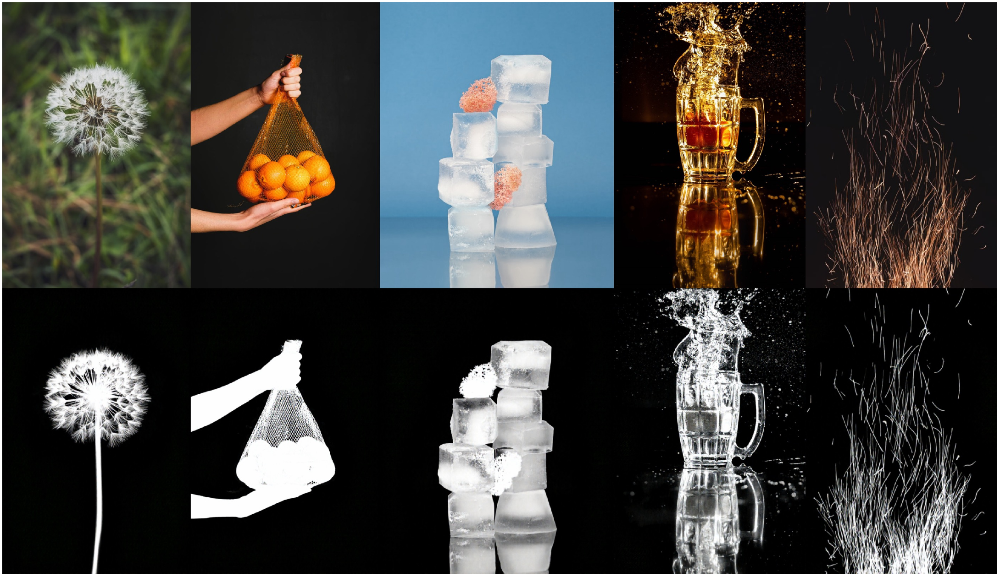

# RenderMatte: Exact-Alpha Rendering and Group-Relative Alignment for Image Matting

**Zecheng Ren**, **Yafei Hu**, **Jianing Zhao**, **Ruichen Cong**, **Qun Jin**, **Yiren Song**

[](https://arxiv.org/abs/2608.08487)
[](https://huggingface.co/Renz-7/RenderMatte)
[](https://huggingface.co/datasets/Renz-7/RenderMatte-dataset/tree/main)
[](https://github.com/Nislab-r/RenderMatte/blob/main/LICENSE)

<p align="center">
  
</p>

> **Abstract:** We present **RenderMatte**, a trimap-guided image matting framework that adapts FLUX.1 Kontext with exact-alpha rendered supervision and group-relative alignment. RenderMatte combines full-parameter SFT, alpha-edge supervision, and matting-specific post-training rewards, achieving high-fidelity open-world alpha prediction across matting benchmarks.

---


## 📰 News

**Aug 12, 2026** Paper, code, dataset, and inference weights released.

---


## 🛠️ Installation


### 1. Environment Setup

```bash
git clone https://github.com/Nislab-r/RenderMatte.git
cd RenderMatte

# Python 3.12 is recommended
conda create -n rendermatte python=3.12
conda activate rendermatte

# SFT / inference environment
cd RenderMatte
pip install -r requirements.txt
```

For GRPO training:

```bash
cd ../RenderMatte_GRPO
pip install -r requirements.txt
```


### 2. Download Models

**Step 1: Download Base Model (FLUX.1-Kontext)**

```bash
# If Hugging Face is not available, use a mirror
export HF_ENDPOINT=https://hf-mirror.com

hf download black-forest-labs/FLUX.1-Kontext-dev   --exclude "transformer/"   --local-dir ./FLUX.1-Kontext-dev
```

Set the model path:

```bash
export MODEL_ROOT=/path/to/FLUX.1-Kontext-dev
```

**Step 2: Download RenderMatte Weights**

Download RenderMatte inference weights from [Renz-7/RenderMatte](https://huggingface.co/Renz-7/RenderMatte):

```bash
hf download Renz-7/RenderMatte --local-dir ckpts/RenderMatte
```

Set the checkpoint paths:

```bash
export SFT_CHECKPOINT=/path/to/full_parameter_sft_checkpoint.safetensors
export GRPO_LORA_PATH=/path/to/rendermatte_lora.safetensors
export LORA_RANK=64
export LORA_ALPHA=128
```

`LORA_RANK` must match the saved LoRA rank. `LORA_ALPHA` controls the LoRA scaling strength at inference time.

**Required Directory Structure:**

```text
RenderMatte/
├── ckpts/
│   └── RenderMatte/
├── FLUX.1-Kontext-dev/
├── assets/
│   └── teaser.png
├── RenderMatte/
└── RenderMatte_GRPO/
```

---


## 🚀 Inference

All commands below should be launched from the SFT code directory:

```bash
cd RenderMatte
```


### RenderMatte-2k

**SFT-only inference:**

```bash
export PYTHON_BIN=/path/to/python
export DATA_ROOT=/path/to/datasets
export MODEL_ROOT=/path/to/FLUX.1-Kontext-dev
export SFT_CHECKPOINT=/path/to/full_parameter_sft_checkpoint.safetensors
export OUTPUT_ROOT=/path/to/eval_output
export BENCHMARKS="RenderMatte-2k"

bash scripts/infer_sft_lora_trimap.sh
```

**SFT + LoRA inference:**

```bash
export PYTHON_BIN=/path/to/python
export DATA_ROOT=/path/to/datasets
export MODEL_ROOT=/path/to/FLUX.1-Kontext-dev
export SFT_CHECKPOINT=/path/to/full_parameter_sft_checkpoint.safetensors
export GRPO_LORA_PATH=/path/to/rendermatte_lora.safetensors
export OUTPUT_ROOT=/path/to/eval_output
export BENCHMARKS="RenderMatte-2k"
export LORA_RANK=64
export LORA_ALPHA=128

bash scripts/infer_sft_lora_trimap.sh
```

The script writes raw predictions, trimap-clamped predictions, and `trimap_summary.json` under `OUTPUT_ROOT`.

---


## 📊 Evaluation


### 1. Prepare Datasets

Download the RenderMatte training and test sets from [Renz-7/RenderMatte-dataset](https://huggingface.co/datasets/Renz-7/RenderMatte-dataset/tree/main):

```text
<DATA_ROOT>/
└── RenderMatte-dataset/
    ├── train/
    │   ├── filenames_train.txt
    │   ├── original/
    │   ├── trimap/
    │   └── mask/
    └── RenderMatte-2k/
        ├── filenames_RenderMatte-2k_relative.txt
        ├── original/
        ├── trimap/
        └── mask/
```

For public matting benchmarks, please follow the official dataset repositories:

- [P3M-10k](https://github.com/JizhiziLi/P3M)
- [AM-2k](https://github.com/JizhiziLi/GFM)
- [AIM-500](https://github.com/JizhiziLi/AIM)

Set the dataset roots before evaluation:

```bash
export DATA_ROOT=/path/to/datasets
export P3M_ROOT=/path/to/P3M-10k
export AM_ROOT=/path/to/AM-2k
export AIM_ROOT=/path/to/AIM-500
```


### 2. Run Evaluation

Supported benchmark names:

```text
RenderMatte-2k  -> RenderMatte-2k
p3m-np          -> P3M-10k-NP
am              -> AM-2k
aim             -> AIM-500
```

Run all supported matting benchmarks:

```bash
cd RenderMatte

export PYTHON_BIN=/path/to/python
export DATA_ROOT=/path/to/datasets
export MODEL_ROOT=/path/to/FLUX.1-Kontext-dev
export SFT_CHECKPOINT=/path/to/full_parameter_sft_checkpoint.safetensors
export GRPO_LORA_PATH=/path/to/rendermatte_lora.safetensors
export OUTPUT_ROOT=/path/to/eval_output
export P3M_ROOT=/path/to/P3M-10k
export AM_ROOT=/path/to/AM-2k
export AIM_ROOT=/path/to/AIM-500
export BENCHMARKS="RenderMatte-2k p3m-np am aim"
export LORA_RANK=64
export LORA_ALPHA=128

bash scripts/infer_sft_lora_trimap.sh
```

The metric order in `trimap_summary.json` is:

```text
MSE, MAD, SAD, Grad, Conn
```

---


## 🏋️ Train


### Prepare Training Dataset

RenderMatte-dataset is built from exact-alpha rendered RGBA foregrounds and diverse background composites. It provides exact strand-level alpha supervision for training and a held-out RenderMatte-2k test split for evaluation.

After downloading the dataset, set:

```bash
export DATA_ROOT=/path/to/datasets
```


### Full-Parameter SFT

```bash
cd RenderMatte

export PYTHON_BIN=/path/to/python
export DATA_ROOT=/path/to/datasets
export MODEL_ROOT=/path/to/FLUX.1-Kontext-dev
export TRAIN_ROOT=<DATA_ROOT>/RenderMatte-dataset
export TRAIN_LIST=<DATA_ROOT>/RenderMatte-dataset/train/filenames_train.txt
export OUTPUT_DIR=/path/to/output/full_parameter_sft

bash scripts/train_full_parameter_matting.sh
```

Useful options:

```bash
export HEIGHT=512
export WIDTH=512
export BATCH_SIZE=2
export LEARNING_RATE=1e-5
export NUM_EPOCHS=30
export SAVE_STEPS=2000
export NUM_WORKERS=0
```


### LoRA SFT

```bash
cd RenderMatte

export PYTHON_BIN=/path/to/python
export DATA_ROOT=/path/to/datasets
export MODEL_ROOT=/path/to/FLUX.1-Kontext-dev
export TRAIN_ROOT=<DATA_ROOT>/RenderMatte-dataset
export TRAIN_LIST=<DATA_ROOT>/RenderMatte-dataset/train/filenames_train.txt
export OUTPUT_DIR=/path/to/output/lora_sft

bash scripts/train_lora_matting.sh
```

To initialize from a full-parameter SFT checkpoint:

```bash
export INIT_DIT_CHECKPOINT=/path/to/full_parameter_sft_checkpoint.safetensors
bash scripts/train_lora_matting.sh
```


### GRPO Alignment

After SFT or LoRA SFT, run the reinforcement learning stage in:

```bash
cd RenderMatte_GRPO
```

Please see:

```text
RenderMatte_GRPO/README.md
```

---


## 📁 Repository Structure

```text
RenderMatte/
├── README.md
├── assets/
│   └── teaser.png
├── RenderMatte/
│   ├── README.md
│   ├── configs/
│   ├── scripts/
│   ├── data_split/
│   ├── lora/
│   ├── models/
│   ├── pipelines/
│   ├── prompters/
│   ├── utils/
│   ├── vram_management/
│   ├── inference_eval.py
│   ├── matting_inference_core.py
│   └── requirements.txt
└── RenderMatte_GRPO/
    ├── README.md
    ├── config/
    ├── rendermatte_grpo/
    │   └── diffusers_patch/
    ├── scripts/
    │   └── accelerate_configs/
    └── requirements.txt
```

---


## 📄 Cite

If you find RenderMatte useful in your research, please consider citing our paper:

```bibtex
@misc{ren2026rendermatteexactalpharenderinggrouprelative,
      title={RenderMatte: Exact-Alpha Rendering and Group-Relative Alignment for Image Matting},
      author={Zecheng Ren and Yafei Hu and Jianing Zhao and Ruichen Cong and Qun Jin and Yiren Song},
      year={2026},
      eprint={2608.08487},
      archivePrefix={arXiv},
      primaryClass={cs.CV},
      url={https://arxiv.org/abs/2608.08487},
}
```


## Contact

If you have any questions, please feel free to contact **Zecheng Ren** at [z.ren@ruri.waseda.jp](mailto:z.ren@ruri.waseda.jp).